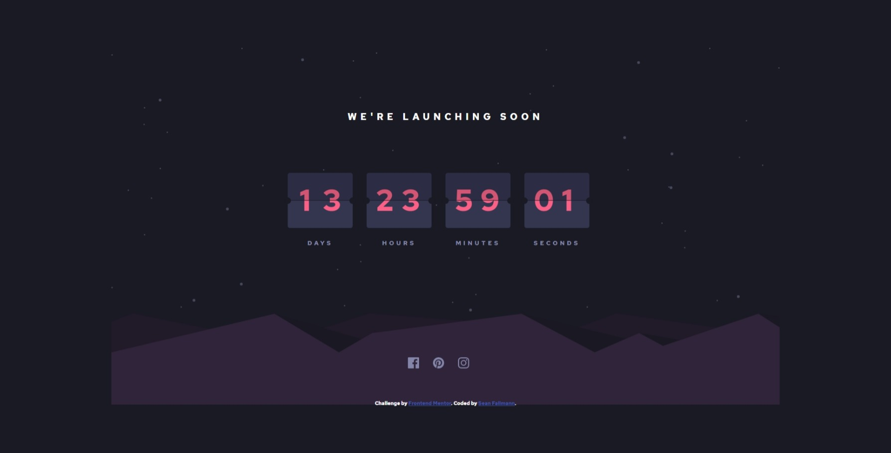

# Frontend Mentor - Launch countdown timer solution

This is a solution to the [Launch countdown timer challenge on Frontend Mentor](https://www.frontendmentor.io/challenges/launch-countdown-timer-N0XkGfyz-). Frontend Mentor challenges help you improve your coding skills by building realistic projects. 

## Table of contents

- [Overview](#overview)
  - [The challenge](#the-challenge)
  - [Screenshot](#screenshot)
  - [Links](#links)
- [My process](#my-process)
  - [Built with](#built-with)
  - [What I learned](#what-i-learned)
  - [Continued development](#continued-development)
  - [Useful resources](#useful-resources)
- [Author](#author)
- [Acknowledgments](#acknowledgments)

**Note: Delete this note and update the table of contents based on what sections you keep.**

## Overview

### The challenge

Users should be able to:

- See hover states for all interactive elements on the page
- See a live countdown timer that ticks down every second (start the count at 14 days)
- **Bonus**: When a number changes, make the card flip from the middle

### Screenshot

### Links

- Solution URL: [https://github.com/sfallmann/countdown-timer-challenge](https://github.com/sfallmann/countdown-timer-challenge)
- Live Site URL: [https://sfallmann.github.io/countdown-timer-challenge/](https://sfallmann.github.io/countdown-timer-challenge/)

## My process
I decided to do this completely from scratch - no libraries or frameworks.

I started with the flipping time segments first.  Then on implemented inline svg (for the text) so I can better emulate those old clocks.

### Built with

- HTML5
- CSS
- Vanilla JavasScript

### What I learned

The usefulness of front end frameworks (such as Vue or React) was reinforced.
